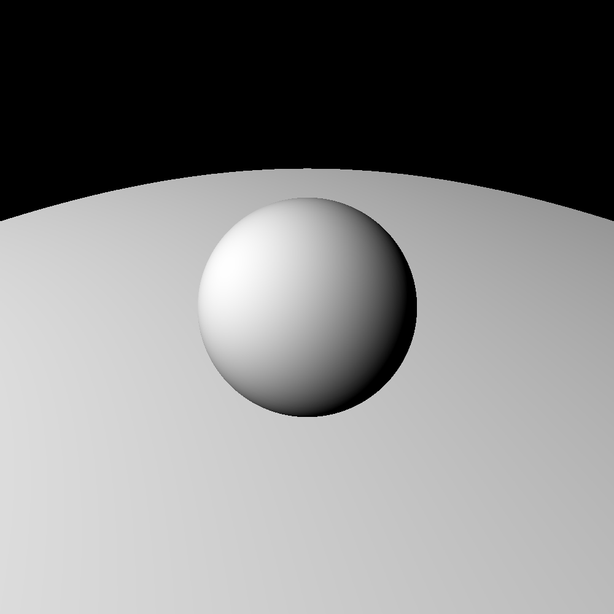
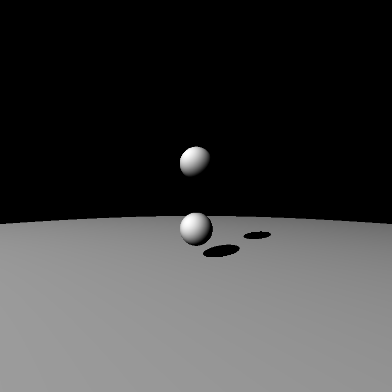
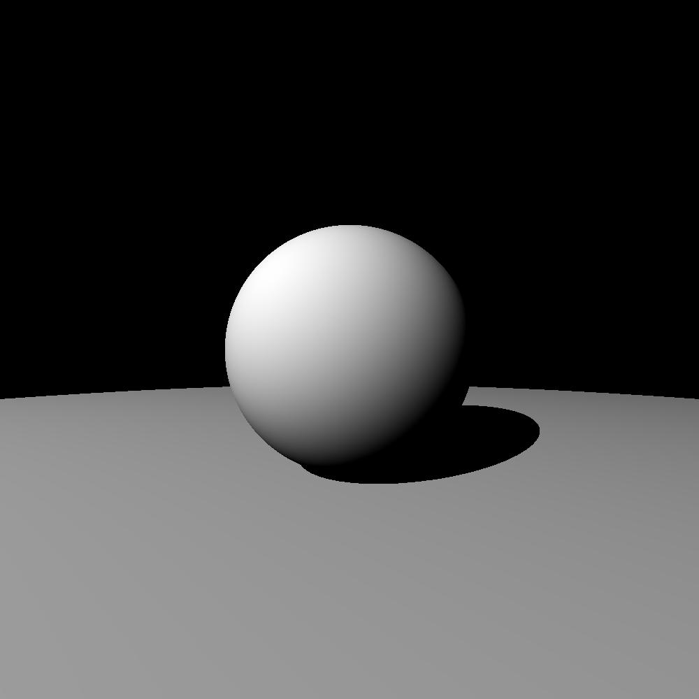

# Ray Marching
This is a project that explores the concept of Ray Marching. This is similar to Ray
Tracing where Rays are cast to the objects to render them in 3d. These rays are also
used to calculate the amount of light and shadow on the objects as well. The mathematical Formula and Theory was coded from scratch and no libraries were used for the rendering part (Libraries were only used to save the created image.)

# Example Images Created Using the Renderer

